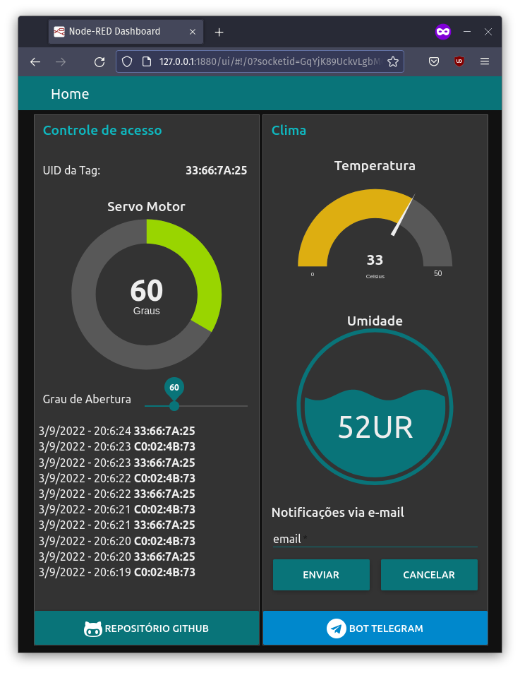

# checkpoint04
Protótipo de um sistema de identificação, desenvolvido na disciplina de IoT.

**nome dos alunos:**

* Carlos Rithyellen de Souza Leal - RM 89052
* Renan da Silva Ramos – RM 89339

**Turma:** 2TDSA

**Ano:** 2° ano, 2022

## Objetivo / descrição do Projeto

Sistema embarcado em uma Raspberry Pi capaz de coletar a identificação da TAG RFID, coletar dados do sensor DHT11 (Temperatura e Umidade) com o Arduino (ARDUINO1) e comunica com o arduino (ARDUINO2) no formato JSON para realizar o sistema de posição do servo motor e envia utilizando formato JSON para um fluxo Node-Red que realiza diversas funções: 
- publica e subscreve em um tópico utilizando o protocolo MQTT.
- Notifica o usuário via telegram(Qualquer alteração na posição do servo motor e a leitura da TAG RFID).
- Notifica via email (Se a umidade estiver abaixo de 50% ou a temperatura estiver acima de 30°C.). 

Um segundo fluxo Node-Red rodando na Cloud da IBM subscreve e publica o tópico, e em um DASHBOARD:
- exibe o valor da TAG e um registro das ultimas leituras
- exibe temperatura e umidade
- controla a posição do servo motor
- Recebe o email do usuário para receber alertas de temperatura e umidade

## Circuito eletrônico

## Dashboard

[Demo do Dashboard](https://node-red-fiap.mybluemix.net/ui)

## Node-Red Flows
IBM Cloud            |  Raspberry Pi
:-------------------------:|:-------------------------:
  |  

## Nós necessários:

Node-Red Raspberry
    
    node-red-contrib-telegrambot
    node-red-node-email
    node-red-node-serialport
    
Node-Red IBM cloud

    node-red-dashboard

## Como usar

- [x] Monte o sistema conforme o circuito elétrico
- [x] Carregue o [código](arduino/arduino.ino) .ino no arduino
- [x] Configure a raspberry em [modo headless](https://www.raspberrypi.com/documentation/computers/configuration.html#setting-up-a-headless-raspberry-pi) e instale o node-red conforme a documentação encontrada [aqui](https://nodered.org/docs/getting-started/raspberrypi)
- [x] Configure uma instância do node-red na cloud da IBM conforme a documentação encontrada [aqui](https://nodered.org/docs/getting-started/ibmcloud)
- [x] instale os nós necessários
- [x] Importe o [flows_ibm](node-red/flows_ibm) na instância node-red na IBM cloud.
- [x] Importe o [flows_rasp](node-red/flows_rasp) no node-red da raspberry.

## Link de vídeo demonstração

Vídeo do projeto e funcionamento.

[Link para o video youtube](https://youtu.be/W0sOezGxFmk)

### Referências 

* [Aulas do Professor Arnaldo](https://arnaldojr.github.io/IoT/)
* [Como usar com Arduino – KIT RFID MFRC522](https://blogmasterwalkershop.com.br/arduino/como-usar-com-arduino-kit-rfid-mfrc522)
* [TEMPO SEM DELAY? CONHEÇA O MILLIS!](https://www.youtube.com/watch?v=rkicyLRCkHI)
* [Working With JSON Data in Node Red](https://www.youtube.com/watch?v=24ZY3CEsiow)
* [Node-Red -How to Send Email and SMS Notifications](https://www.youtube.com/watch?v=rokLM4ZsMJQ)
* [CONTROLE DE SERVO MOTOR VIA SERIAL | Curso de Arduino #211](https://www.youtube.com/watch?v=o2RVatVYCF)
* [Steve Cope - Node-Red Example Flows](https://stevesnoderedguide.com/node-red-example-flows)
